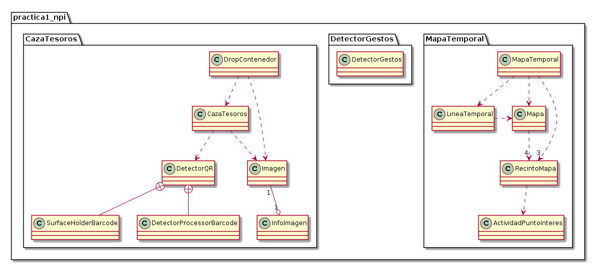
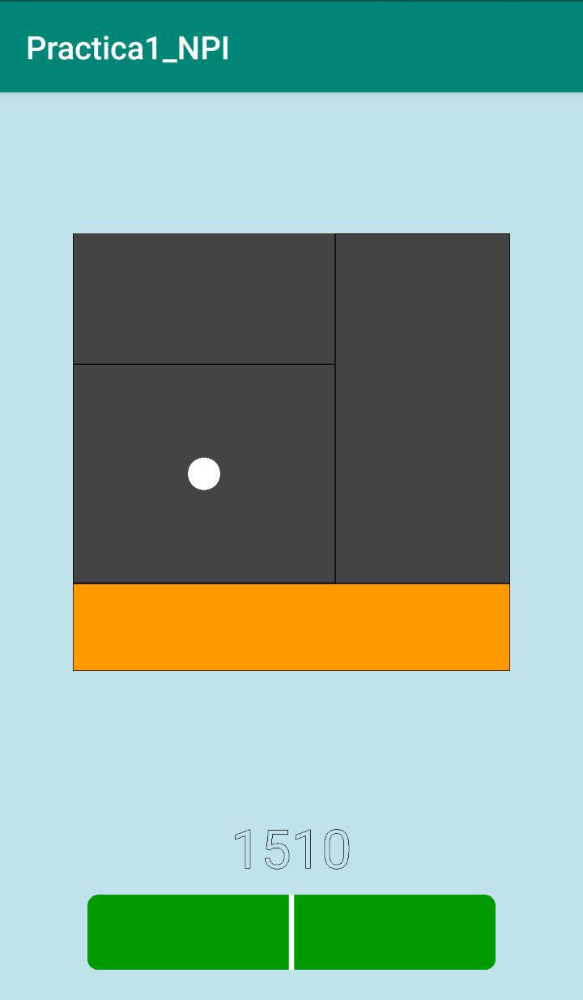
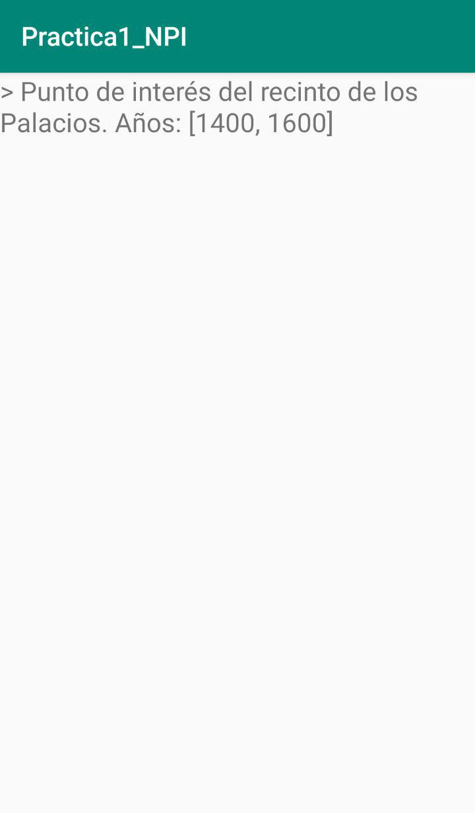
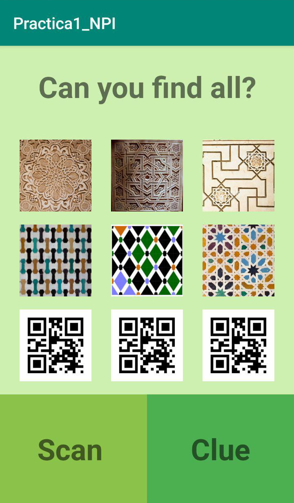
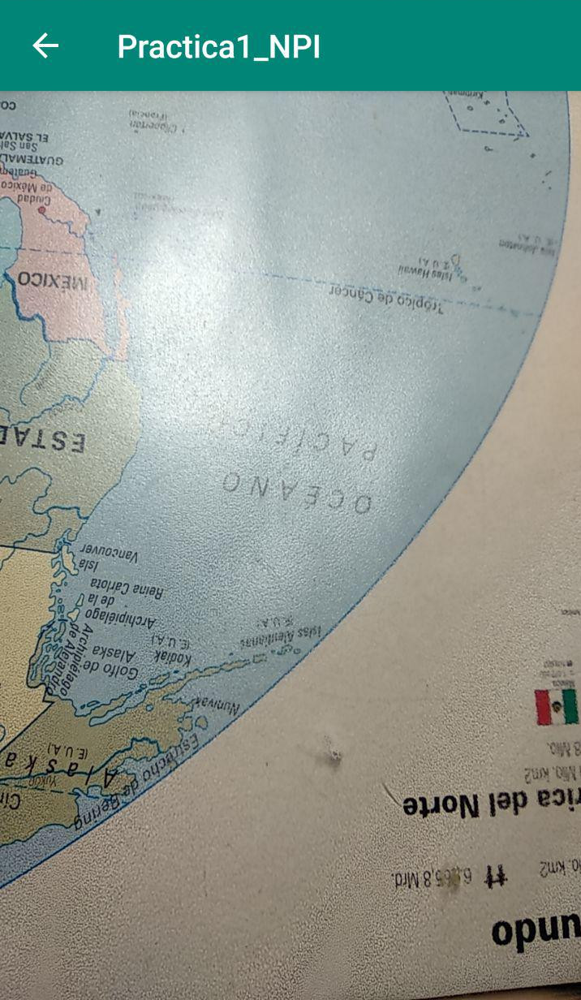
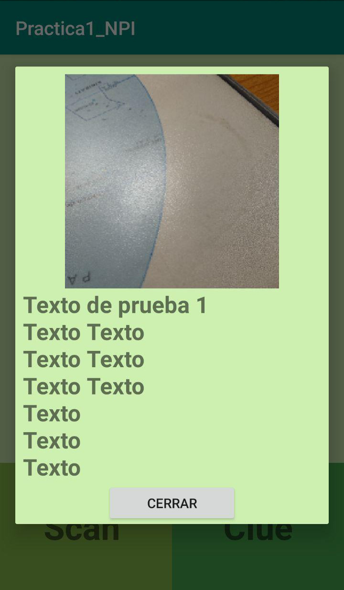

# Práctica 1 - NPI

## Autores
- Paula Iglesias
- Carlos Núñez
- Miguel Lentisco

## Documentación
La documentación extensa se encuentra adjuntada en el directorio `documentacion`, abriendo el archivo `index.html`. Se ha generado con `Java-doc`, e incluye los métodos, atributos, descripciones...

## Diagrama de clases
El diagrama de clases es el siguiente

## Layouts
Aqui mostramos las diferentes layouts que se han creado en la aplicación, con una prueba en vivo.

### MapaTemporal
- MapaTemporal:
  

- TextoPuntoInteres:
  

### CazaTesoros

- CazaTesoros:
  

- DetectorQR:
  

  

- InfoImagen:
  

## Interacciones

### MapaTemporal
Cambiamos el año deslizando horizontalmente los dos dedos sobre la línea temporal. Además podemos cliquear cuando salga en el mapa un punto de interés para obtener información. También reconoce nuestra posición en el mapa de recintos.

### CazaTesoros
Mantenemos pulsado en cualquier imagen y luego podemos arrastrarla para interactuar con dos de los contenedores que tenemos abajo "Clue" (pista) o "Scan" (escanar). Si es imagen QR tendrá que detectar un código que tenga "QR1", "QR2" o "QR3"; si es imagen normal tomaremos una foto y se sustituirá. Una vez desbloqueada al matener pulsado nos sale un recuadro con información sobre la imagen.

### DetectorGestos
Tanto en MapaTemporal como en CazaTesoros podemos realizar un gesto sobre la pantalla que sea en forma de "m" o "q". Si es una "m" se cambiará a MapaTemporal; si es una "q" cambiamos a CazaTesoros (QR).
